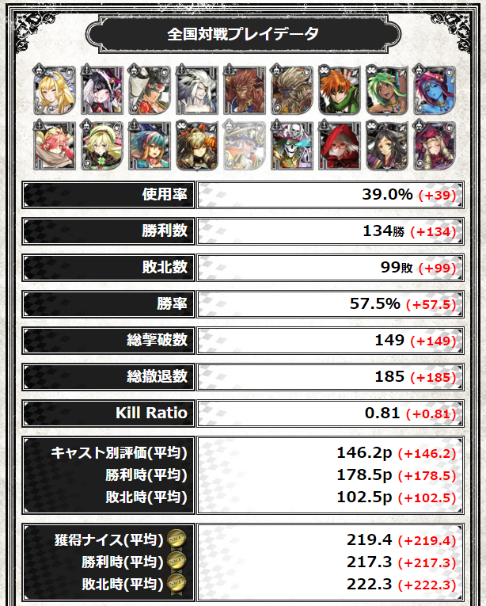

WLWブックマークレット + 1
====

本ブックマークレットでは、&copy;SEGAが提供するWonderland Warsにおける[Wonderland.NET](https://wonderland-wars.net/)のマイキャストページの表示をカスタマイズする機能を提供します。



本機能では次の内容を実現します。
* 勝率など通常では表示されない項目の表示する機能※1  
* 前回の表示結果との差分を表示する機能※2  
* 全キャスト勝率(全員)を表示する機能※3  
* 各キャストの情報をボタンで切り替える機能 

※1: 勝利数、キャスト別評価から計算した結果なので、正確な数値でない可能性があります。  
※2: Cookieに前回の表示結果を記録し、差分を計算して表示しています。  
※3: 試合数が0のキャストは表示されません。

## リリース情報

本ブックマークレットのリリース情報は次の通りです。

* Version 1.0 -> 2016.01.31 Released
  * マイキャストの一覧画面から、獲得済みキャストの情報を取得する機能を追加。
  * 各キャストの情報を取得して、ボタンにより表示内容を切り替える機能を追加。

## 注意制限

本ブックマークレットは、&copy;SEGA公式のツールではありません。Wonderland Warsのサービス提供ポリシー(ネガティブ要素の非公開)に反する可能性のあるツールです。

また、本機能を実現するために使用している技術から次のようなリスクがあります。内容を理解した上で、自己責任でご利用ください。何かトラブル等ありましても、こちらで責任を取ることはできません。

* JavaScriptによるHTMLの書き換えによるWonderland.NETの動作不良
* JavaScriptの本体が外部サイト(github)にあることから、利用者が認知し難いプログラムの改変  
* Cookieの書き換えによるWonderland.NETの動作不良  

## インストール

次の手順で、ブックマークを登録してください。

* 手順1. 適当なブックマークを作成します。
* 手順2. ブックマークの編集でURL部分を次のように書き換えてください。記述ミスを防止するため、コピー&ペーストを推奨します。  

```
javascript:(function(d,s){s=d.createElement('script');s.src='https://rawgit.com/plz-monoeye-cast/wlw/master/wlw-cast-custom-plus1.js ';d.body.appendChild(s);})(document)
```

* 手順3. [Wonderland.NET](https://wonderland-wars.net/)にアクセスし、マイキャストでキャスト一覧(https://wonderland-wars.net/mycast.html)を表示してください。
* 手順4. 手順1,2で作成したブックマークを実行してください。 
* 手順5. 「獲得済みキャスト情報取得が完了しました。」とメッセージが表示されれば完了です。

## 使い方

### 新たにキャストを獲得した場合、インストールの手順3～5を再度実行してください。

次の手順で、登録したブックマークを実行してください。

* 手順1. [Wonderland.NET](https://wonderland-wars.net/)にアクセスし、マイキャスト> (キャスト選択)で全国対戦プレイデータの画面を表示してください。  
* 手順2. インストールで登録したブックマークを実行してください。  
* 手順3. 勝率や差分(赤字の括弧書き)が表示されたら成功です。※4,5,6
※4: 初回は0を基準とした差分が値として表示され、0時でリセットされます。  
※5: ※4を回避したい人は、OSの日付を1日以上前に設定してから手順4を実施し、日付を元に戻してください。  
※6: 差分は毎日0時(正確には23時59分59秒)でリセットされます。

## モバイル版Chromeでのブックマークの実行方法

モバイル版Chromeでは、通常のブックマークからブックマークレットを実行することができません。  
次の手順で、登録したブックマークを実行してください。

* 手順1. URL欄に登録したブックマークの名称を入力してください。  
* 手順2. URLサジェストのリストに、登録したブックマーク名が表示されますので、登録したブックマーク名を選択してください。  

## 著者

Wonderland Wars ワンダーランドウォーズ  
32ページ目 > [833 ID:GUHfLX0k0](https://github.com/syara-temp/wlw)

plz-monoeye-cast（追加機能）

##参考元
本気でやっつけてやるんだから！
(https://github.com/wlw-bookmarklet/matchlog/blob/master/README.md)
